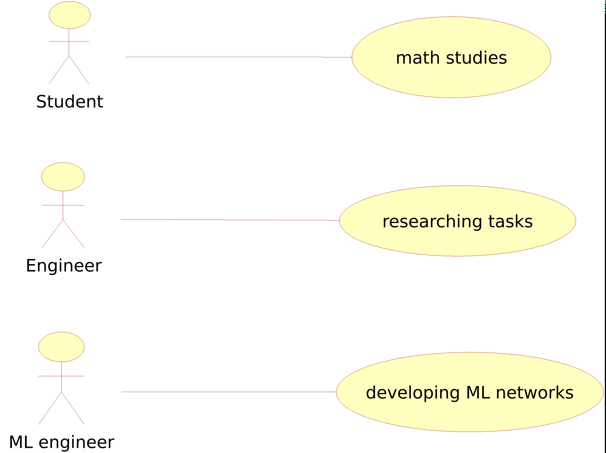
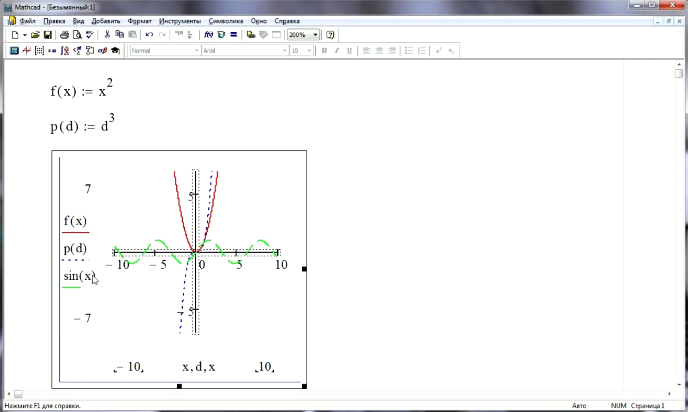
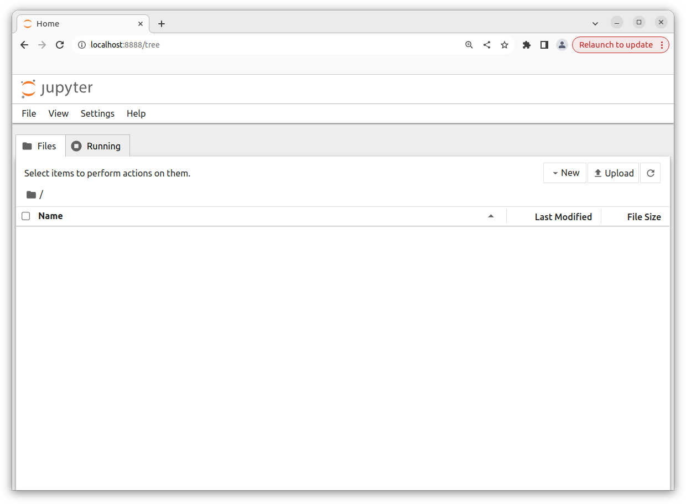
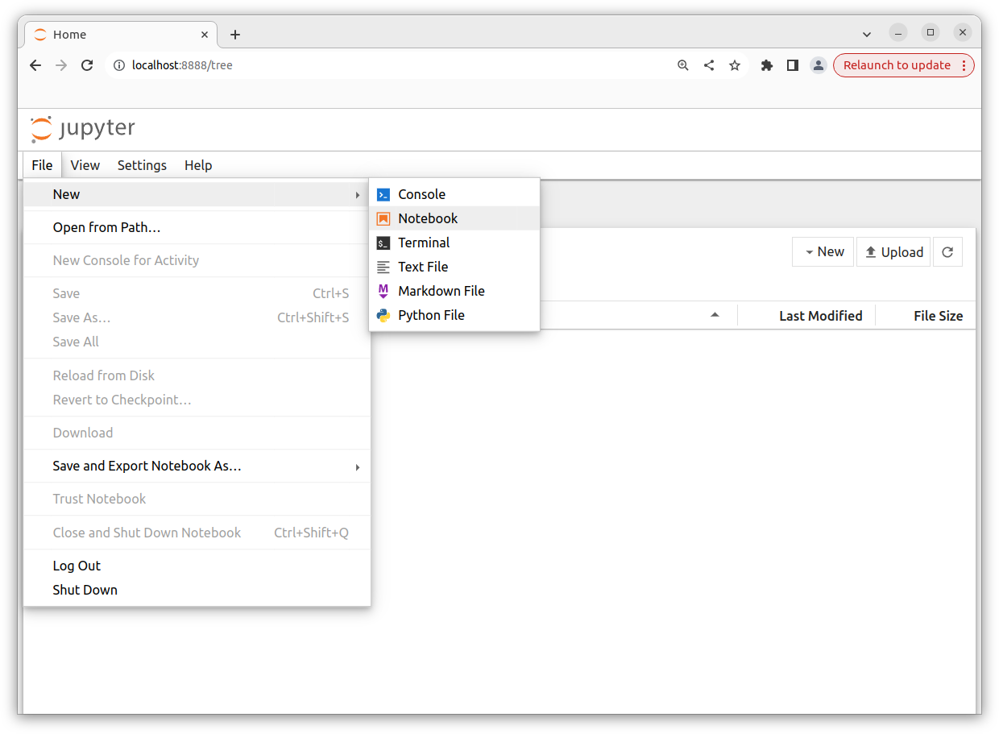
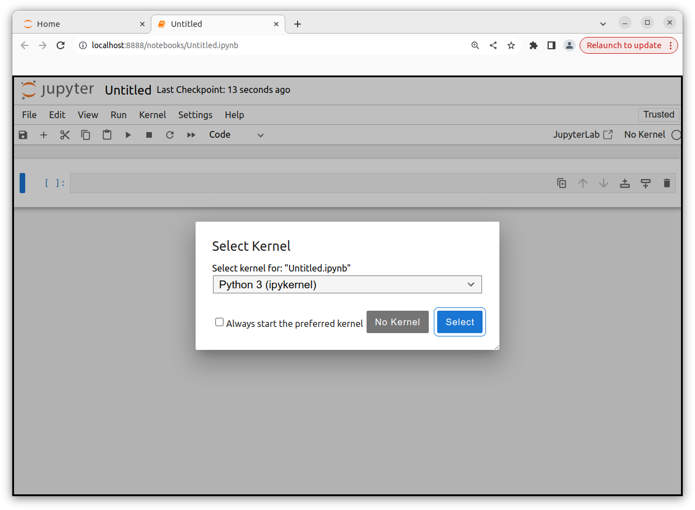
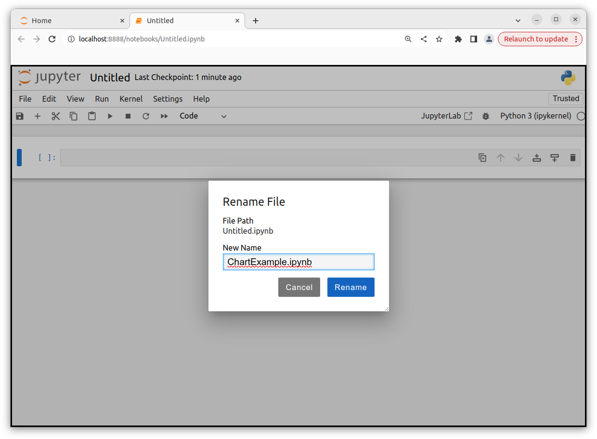
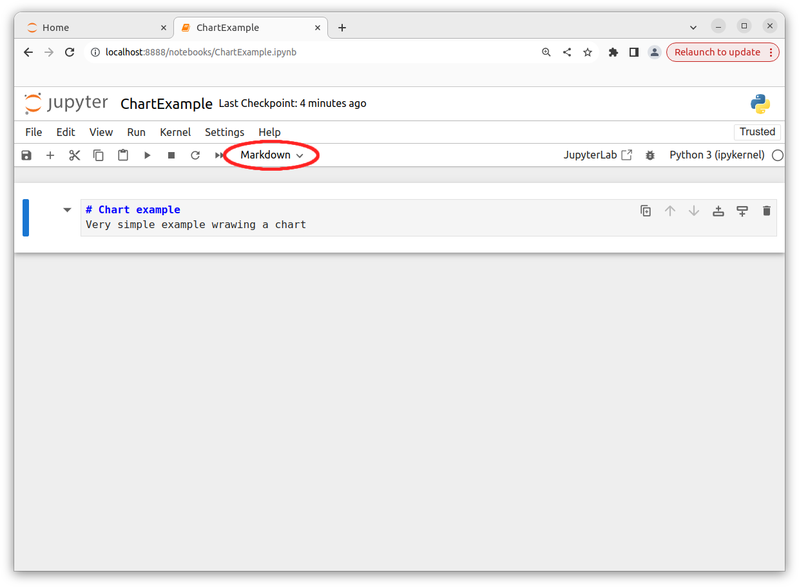
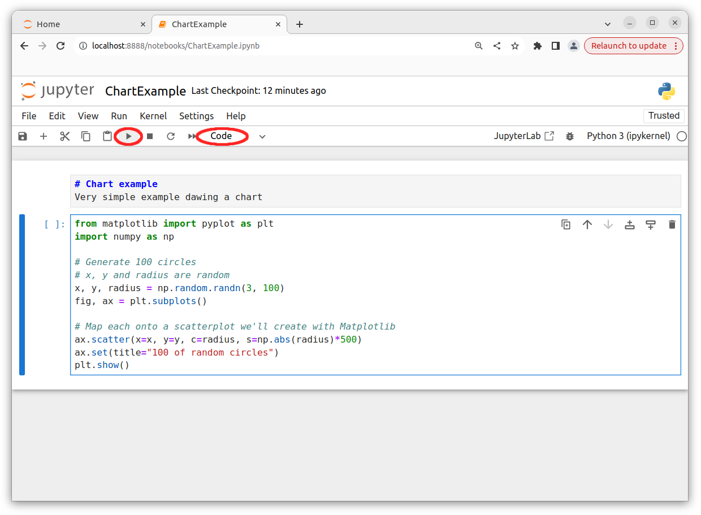
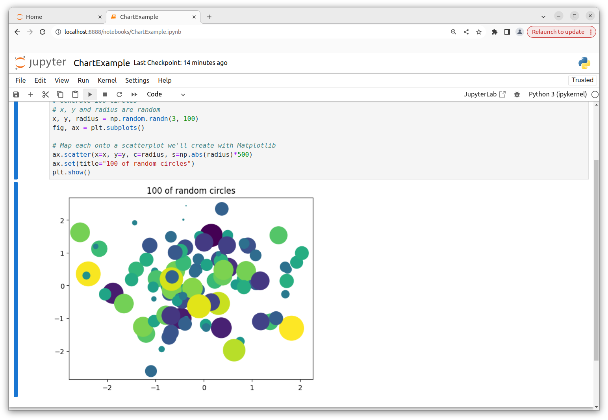

<div align="center">
    
</div>

# Intro
Docker image with Jupyter and math tools:
* matplotlib
* numpy
* pandas
* torch
* torchvision
* torchaudio
* opencv-python

---


# Use-cases
* As a student I need a Jupyter setup for math studies.
* As an engineer I need a Jupyter setup for researching tasks.
* As a ML engineer I need a Jupyter setup for developing ML networks.

<div align="center">
    
</div>

---


# Briefly about Jupyter

Back to 90-s there were 2 very popular MathCad and Matlab tools.\
These 2 were widely used for many areas like computing spectrums, digital filters, counting probabilities, etc.\
Students used to make their projects using these tools.
This could look like this:
<div align="center">
    
</div>

Nowadays when Python is in power I believe the studs are using Jupyter. 

---


## Jupyter Notebook Vs JupyterLab

***Jupyter Notebook*** is a web-based interactive computational environment for creating Jupyter notebook documents.\
It supports several languages like Python (IPython), Julia, R etc. and is largely used for data analysis, data visualization and further interactive, exploratory computing.


***JupyterLab*** is the next-generation user interface including notebooks.\
It has a modular structure, where you can open several notebooks or files (e.g. HTML, Text, Markdowns etc) as tabs in the same window.\
It offers more of an IDE-like experience.


For a beginner - consider Jupyter Notebook as it just consists of a filebrowser and a notebook editor view.\
It might be easier to use.\
If you want more features, switch to JupyterLab.\
JupyterLab offers much more features and an enhanced interface, which can be extended through extensions: [JupyterLab Extensions](https://github.com/search?q=topic%3Ajupyterlab-extension&type=Repositories)

---


# Examples
This repository already contains examples notebooks.\
The whole ***src*** folder is mounted into conteiner.\
***src*** is used for exchanging notebooks between host and container.\
Any changes made inside of ***src*** on host will appear in container and vice-versa.\
The best place to keep Jupyter notebooks for editing and testing.

---


# To build the image
```
$ bash build.sh
```

Check the image is created
```
$ docker images
REPOSITORY            TAG       IMAGE ID       CREATED        SIZE
dev_factory_jupyter   latest    29912ba846e7   18 hours ago   8.6GB
```

---


# To run the image
```
$ bash run.sh 
[W 2024-01-02 06:13:17.066 ServerApp] A `_jupyter_server_extension_points` function was not found in jupyter_lsp. Instead, a `_jupyter_server_extension_paths` function was found and will be used for now. This function name will be deprecated in future releases of Jupyter Server.
[W 2024-01-02 06:13:17.119 ServerApp] A `_jupyter_server_extension_points` function was not found in notebook_shim. Instead, a `_jupyter_server_extension_paths` function was found and will be used for now. This function name will be deprecated in future releases of Jupyter Server.
[I 2024-01-02 06:13:17.120 ServerApp] jupyter_lsp | extension was successfully linked.
[I 2024-01-02 06:13:17.128 ServerApp] jupyter_server_terminals | extension was successfully linked.
[I 2024-01-02 06:13:17.139 ServerApp] jupyterlab | extension was successfully linked.
[I 2024-01-02 06:13:17.147 ServerApp] notebook | extension was successfully linked.
[I 2024-01-02 06:13:17.150 ServerApp] Writing Jupyter server cookie secret to /home/dev_factory_jupyter/.local/share/jupyter/runtime/jupyter_cookie_secret
[I 2024-01-02 06:13:17.525 ServerApp] notebook_shim | extension was successfully linked.
[I 2024-01-02 06:13:17.550 ServerApp] notebook_shim | extension was successfully loaded.
[I 2024-01-02 06:13:17.555 ServerApp] jupyter_lsp | extension was successfully loaded.
[I 2024-01-02 06:13:17.556 ServerApp] jupyter_server_terminals | extension was successfully loaded.
[I 2024-01-02 06:13:17.561 LabApp] JupyterLab extension loaded from /home/dev_factory_jupyter/Jupyter/.jupyter-venv/lib/python3.10/site-packages/jupyterlab
[I 2024-01-02 06:13:17.561 LabApp] JupyterLab application directory is /home/dev_factory_jupyter/Jupyter/.jupyter-venv/share/jupyter/lab
[I 2024-01-02 06:13:17.562 LabApp] Extension Manager is 'pypi'.
[I 2024-01-02 06:13:17.568 ServerApp] jupyterlab | extension was successfully loaded.
[I 2024-01-02 06:13:17.574 ServerApp] notebook | extension was successfully loaded.
[I 2024-01-02 06:13:17.575 ServerApp] Serving notebooks from local directory: /home/dev_factory_jupyter/Jupyter
[I 2024-01-02 06:13:17.575 ServerApp] Jupyter Server 2.12.1 is running at:
[I 2024-01-02 06:13:17.575 ServerApp] http://localhost:8888/tree?token=bec8c1402b3ee60b1857c0fed871eef7645891f2bf6f9fd0
[I 2024-01-02 06:13:17.575 ServerApp]     http://127.0.0.1:8888/tree?token=bec8c1402b3ee60b1857c0fed871eef7645891f2bf6f9fd0
[I 2024-01-02 06:13:17.575 ServerApp] Use Control-C to stop this server and shut down all kernels (twice to skip confirmation).
[C 2024-01-02 06:13:17.581 ServerApp] 
    
    To access the server, open this file in a browser:
        file:///home/dev_factory_jupyter/.local/share/jupyter/runtime/jpserver-7-open.html
    Or copy and paste one of these URLs:
        http://localhost:8888/tree?token=bec8c1402b3ee60b1857c0fed871eef7645891f2bf6f9fd0
        http://127.0.0.1:8888/tree?token=bec8c1402b3ee60b1857c0fed871eef7645891f2bf6f9fd0
[I 2024-01-02 06:13:17.624 ServerApp] Skipped non-installed server(s): bash-language-server, dockerfile-language-server-nodejs, javascript-typescript-langserver, jedi-language-server, julia-language-server, pyright, python-language-server, python-lsp-server, r-languageserver, sql-language-server, texlab, typescript-language-server, unified-language-server, vscode-css-languageserver-bin, vscode-html-languageserver-bin, vscode-json-languageserver-bin, yaml-language-server
```


Once container is stared - it prints out url Jupyter is available at ***with auth token***\
In this case it's ***http://localhost:8888/tree?token=bec8c1402b3ee60b1857c0fed871eef7645891f2bf6f9fd0*** \

Simply copy that url and paste it into your web browser:
<div align="center">
    
</div>

Than you can create an new notebook and start counting things:
<div align="center">
    
</div>

Select ***Python 3*** kernel:
<div align="center">
    
</div>

Assign a name to new notebook
<div align="center">
    
</div>

# Create markdown cell
<div align="center">
    
</div>

# Create code cell, draw a chart and run the cell
<div align="center">
    
</div>

# Run the notebook
<div align="center">
    
</div>


# To run the image and start bash session
```
bash run.sh dev_factory_jupyter --entrypoint=/bin/bash
```


# Jupyter examples
* https://jupyter.org/try-jupyter/lab/?path=notebooks%2FIntro.ipynb
* https://docs.kanaries.net/topics/Python/jupyterlab-vs-notebook
* https://pypi.org/project/opencv-python/

